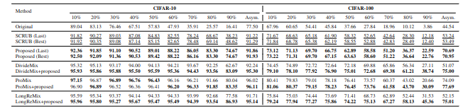
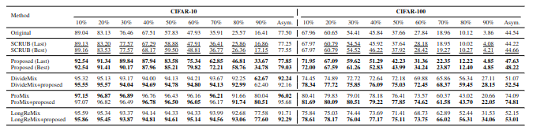

# FSPMU

**Feature Space-Preserving Machine Unlearning for Robust Image Classification with Noisy Labels**  


## Overview

This repository contains the implementation of **FSPMU**, 

## Requirements
- Python==3.10.12
- CUDA==12.4
- PyTorch==2.1.0a0


## Datasets
We utilized the CIFAR-10 and CIFAR-100. 

## Model Training

The model training process consists of two main steps: **Pre-trained Model Training** and **Model Unlearning**. A framework for unlearning for forgetting noisy labels. The proposed method enables post-hoc model improvement by forgetting incorrect information through feature-based unlearning and recovering correct knowledge using the same feature representations. 

---

### Step 1: Pre-trained Model Training

You indicate dataeset and noise_mode, noise-rate.
For example, to run an experiment for cifar-10, with 50% symmetric noise, run:
```shell
python main.py --dataset cifar10 --noise_rate 0.5 --noise_mode sym --save True --tsne True
```

### Step 2: Model Unlearning
You indicate pre-trained method, dataset and noise_mode to select model to do unlearning.
For example, to run an experiment for cifar-10, with 50% symmetric noise, run:
```shell
python unlearning.py --dataset cifar10 --noise_rate 0.5 --noise_mode sym --method pro  --pred gmm

```
"--pred" is either to use Gausian Mixture Model. If you want to experience "known noisy label", you would set "--pred" to "None".

## Parameters
| | $\delta$ | $\zeta$ | $\gamma$ | t | batch size(forget set) | batch size(retain set) |
| Original | 500 | 0.5 | 1 | 0.25 | 512 | 128 |
| NLL | 1 | 1 | 5 | 0.25 | 512 | 128 |

## Results



## Paper Status


## Citation

A BibTeX entry will be provided here upon acceptance.
