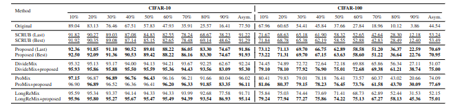
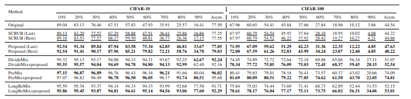

# FSPMU

**Feature Space-Preserving Machine Unlearning for Robust Image Classification with Noisy Labels**  


## Overview

This repository contains the implementation of **FSPMU**, a novel noisy-label learning framework leveraging machine unlearning. By utilizing class centroids in the feature space to perform selective unlearning, our method successfully removes noisy samples from pre-trained models, achieving significant improvements in accuracy.

## Requirements
- Python==3.10.12
- CUDA==12.4
- PyTorch==2.1.0a0


## Datasets
We utilized the CIFAR-10 and CIFAR-100. 

## Model Training

The model training process consists of two main steps: **Pre-trained Model Training** and **Model Unlearning**. A framework for unlearning for forgetting noisy labels. The proposed method enables post-hoc model improvement by forgetting incorrect information through feature-based unlearning and recovering correct knowledge using the same feature representations. 

---

### Step 1: Pre-trained Model Training
You indicate dataeset and noise_mode, noise-rate.
For example, to run an experiment for cifar-10, with 50% symmetric noise, run:
```shell
python main.py --dataset cifar10 --noise_rate 0.5 --noise_mode sym --save True --tsne True
```
--save: When set to True, the trained model weights will be saved in the weight/ directory, located two levels above the execution directory.

--tsne: When set to True, a 2D visualization of the feature space using t-SNE will be generated and saved in the current directory.

Note: This feature is exclusively available for the CIFAR-10 dataset.

#### Expected Directory Structure
```text
.
├── weight/
│   ├── net/             # Saved models (.pth, etc.) --save True
│   └── TSNE/            # t-SNE visualization images --tsne True
└── your_project/
    └── scripts/         # Execute your script here
```

### Step 2: Model Unlearning
You indicate pre-trained method, dataset and noise_mode to select model to do unlearning.
For example, to run an experiment for cifar-10, with 50% symmetric noise, run:
```shell
python unlearning.py --dataset cifar10 --noise_rate 0.5 --noise_mode sym --method pro  --pred gmm --pretrain_method None --tsne 0 --save True
```
--method: Select `scrub` or `pro`. `scrub` uses the SCRUB method, while `pro` uses the proposed method.

--pred: Specifies the prediction method. Set this to `GMM` to use a Gaussian Mixture Model. To use known noisy labels instead, set this to `None`.

--tsne: Choose from (0, 1, 2).  
'0' disables TSNE image generation.  
'1' generates TSNE images after the `e_n` and `e_r` epochs.  
'2' generates the same TSNE images as '1', plus an additional image from the epoch with the best accuracy.

--save: When set to `True`, the trained model weights will be saved in the `weight/` directory located two levels above the execution directory.

--pretrain_method: Choice None, DivideMix, ProMix, or LongReMix. None corresponds to standard CE learning (Original). To use models trained with methods other than Original, please refer to the following repository:

-DivideMix:
https://github.com/LiJunnan1992/DivideMix

-ProMix:
https://github.com/Justherozen/ProMix

-LongReMix:
https://github.com/filipe-research/LongReMix


### Step 3: Feature Space Visualization
To create TSNE visualizations for the unlearned model, move the model generated in Step 2 to the current directory (`./`).

For example, to run an experiment on CIFAR-10 with 50% symmetric noise, execute:
```shell
python visualize.py --dataset cifar10 --noise_rate 0.5 --noise_mode sym --method pro  --pred gmm --pretrain_method None
```

## Parameters
Original and Noisy Label Learning(NLL) use each following parameter.
| Method | $\delta$ | $\zeta$ | $\gamma$ | $t$ | batch size (forget set) | batch size (retain set) |
| :--- | :---: | :---: | :---: | :---: | :---: | :---: |
| Original | 500 | 0.5 | 1 | 0.25 | 512 | 128 |
| NLL | 1 | 1 | 5 | 0.25 | 512 | 128 |
## Results
CIFAR10



CIFAR100



## Paper Status
The paper is currently under review at IEEE Access.

Note:
As the manuscript is under peer review, the repository is currently in a limited-release state. Some details, including datasets, trained models, and complete documentation, will be provided after the review process concludes.


## Citation

A BibTeX entry will be provided here upon acceptance.
